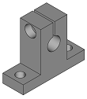
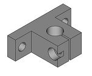
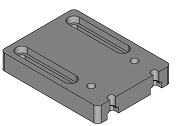
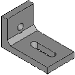
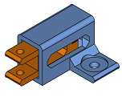
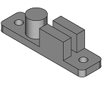
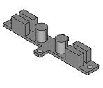
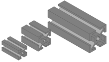
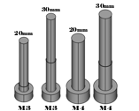

# Mechatronic
---
Select your lenguage:
## English
  This repository have the parts of a mechatronic system

  ---
  
### Index
  * [Folder organization](#folder-organization)
  * [Stable Version](#stable-version)
  * [How it's works](#how-its-works)
    * [Components](#components)
    * [Mechatronic system](#mechatronic-systems)
    * [Functions](#functions)
  ---
### Folder organization
  - comps: copy of the repository [fcad-comps](https://github.com/felipe-m/fcad-comps) of Felipe Machado.
  - icons: icons of the workbench.
  - parts: 
  - src: source code
      - func: functions makes for the workbench
  ---
### Stable version
  The stable version is in the file [Mechatronic.zip](https://github.com/davidmubernal/Mechatronic/blob/master/Mechatronic.zip). This version run in FreeCAD 0.18

  ---
### How it's works
  This workbench has some parts of a mechatronic system. You can modify this parts and build your system.
#### Components:

  Shaft holder
  - Size
  - Low profile: only size 8

  
    

  Idle pulley holder
  - Size of the profile
  - Metric Nut
  - Height
  - Position of the end stop sensor
  - Height of the end stop sensor

  End stop holder
  - Type
  - Distance of the rail

  
  

  Hall stop holder
  - Width
  - Thikness
  - Metric nut
  - Profile size
  - Reinforce

  

  Bracket
  - Type: 3 options
  - Size first profile
  - Size second profile
  - Thickness
  - Metric nut first profile
  - Metric nut second profile
  - Number of nuts
  - Distance betwen nuts
  - Type of hole
  - Reinforcment: first type only
  - Flap: second type only
  - Distance between profiles: third type only

  
  
  

  Motor holder
  - Size
  - Height
  - Thickness

  
  

  Lin bear house
  - Type

  
  

  Filter holder
  - Length
  - Width

  

  Tensioner
  - Belt hight
  - Base width
  - Thickness
  - Metric nut

  

  Belt clamp
  - Type
  - Length
  - Width
  - Metric nut

  
  

  Aluminium profile
  - Secction
  - Length

  

  Bolts, Nuts & Washers
  - Type
  - Metric
  - Bolt legnth

  
  
  

#### Mechatronic Systems:
  Filter Stage
  - Move distance
  - Filter length
  - Filter width
  - Base width
  - Tensioner stroke
  - Tensioner thickness
  - Metric nut
  - Motor size
  - Lenght rail motor holder
  - Motor holder thickness

  

#### Functions:
  
  - Change to print position
  
    Change the position of the piece to print position. Also, the user can select the folder where is save the piece.

  - Assembly
 
    Select the part you like and a new place.

  ---
  ---