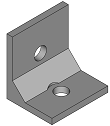
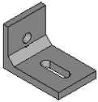
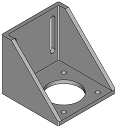
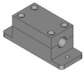
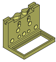
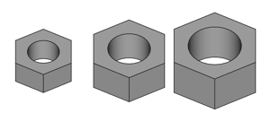
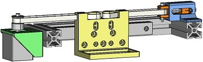

# Mechatronic
---

## Español
  Este repositorio tiene componentes de un sistema mecatrónico.

### Índice
  * [Organización de las caperpetas](#organización-de-las-carpetas)
  * [Versión estable](#verión-estable)
  * [Funcionamiento del workbench](#funcionamiento-del-workbench)  
    * [Componentes](#componentes)
    * [Sistemas mecatrónicos](#sistemas-mecatrónicos)
    * [Funciones](#funciones)

  ---
### Organización de las carpetas:
  - comps: copia del repositorio [fcad-comps](https://github.com/felipe-m/fcad-comps) de Felipe Machado.
  - icons: iconos del workbench.
  - parts: 
  - src: código fuente
      - func: funciones creadas para el workbench

  ---
### Versión estable:
  La versión estable del workbench se encuentra en el archivo comprimido [Mechatronic.zip](https://github.com/davidmubernal/Mechatronic/blob/master/Mechatronic.zip). Funciona en FreeCAD 0.18

  ---
### Funcionamiento del workbench

  El workbench consta de un conjunto de piezas empleadas en sistemas mecatrónicos.  
  En función de la pieza que seleccionemos tendremos distintas opciones de modificación

#### Componentes:
  Soporte de eje
  
  - Tamaño
  - Perfil bajo: sólo para tamaño 8

  
  

  Soporte polea loca
  - Tamaño del perfil sobre el que se monta
  - Métrica de los tornillos
  - Altura
  - Posición del sensor de final de carrera
  - Altura del sensor de final de carrera

  Soporte final de carrera
  - Tipo
  - Distancia del carril

  
  

  Soporte final
  - Ancho
  - Espesor
  - Métrica tornillo
  - Tamaño perfil
  - Refuerzo

  

  Bracket para perfiles
  - Tipo: 3 opciones distintas
  - Tamaño primer perfil
  - Tamaño segundo perfil
  - Espesor
  - Métrica tornillo primer perfil
  - Métrica tornillo segundo perfil
  - Número de tornillos
  - Distancia entre tornillos
  - Seleccion agujero
  - Refuerzo: sólo para el primer tipo de bracket
  - Flap: sólo para el segundo tipo de bracket
  - Distancia entre perfiles: sólo para el tercer tipo de bracket

  
  
  

  Soporte motor
  - Tamaño del soporte
  - Altura del soporte
  - Espesor de las paredes del soporte

  
  

  Carcasa del rodamiento lineal
  - Tipo

  
  

  Soporte del filtro
  - Largo
  - Ancho

  

  Tensionador de la polea
  - Altura de polea
  - Ancho de base
  - Espesor
  - Métrica del tornillo

  

  Abrazadera de polea
  - Tipo
  - Largo
  - Ancho
  - Métrica del tornillo

  
  

  Perfil de aluminio
  - Sección
  - Longitud

  

  Tornillos, Tuercas y Arandelas
  - Tipo
  - Métrica
  - Longitud del tornillo

  
  
  

#### Sistemas mecatrónicos:
  Filter Stage    
  - Distancia de recorrido
  - Largo del filtro
  - Ancho del filtro
  - Ancho de base
  - Largo tensionador
  - Espesor tensionador
  - Métrica del tornillo
  - Tamaño del motor
  - Longitud del rail del soporte motor
  - Espesor del soporte motor

  

#### Funciones:
  - Cambiar a posición de imprimir:
 
       Coloca la pieza seleccionada en la posición de impresión y pide al usuario la carpeta donde exportar la pieza.

  - Ensamblaje
    Selecciona la pieza y su nueva posición.
  ---
  --- 
