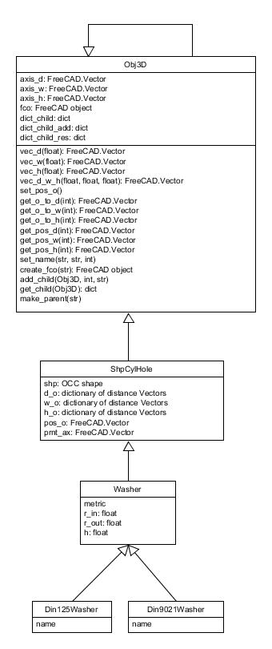

.. Documento con toda la información sobre las piezas y las funciones

Wiki
****

.. note:: 
    This is a basic view of the Wiki

3D Model library
================

Mechatronic
-----------

Shaft Holder
^^^^^^^^^^^^^

    * Size
    * Low profile: Only in size 8

    .. image:: ../parts/img/sk08.png
        :height: 148px
        :alt: Shaft Support Size 8

    .. image:: ../parts/img/sk08_pillow.png
        :height: 148px
        :alt: Shaft Support Size 8 Low Profile

.. toggle-header::
    :header: Details

    .. currentmodule:: comps
    .. autosummary::
        Sk_dir    

Idler Holder
^^^^^^^^^^^^^

    * Size of the profile on which it is mounted
    * Bolt metrics
    * Height
    * Position of the limit switch sensor
    * Height of the limit switch sensor

    ::

        The model will be modified for greater efficiency

.. toggle-header::
    :header: Details

    .. currentmodule:: parts
    .. autosummary::
        IdlePulleyHolder
    
Limit Switches Holder
^^^^^^^^^^^^^^^^^^^^^

    * Type
    * Rail distance

    .. image:: ../parts/img/endstop_holder_30.png
        :height: 148px
        :alt: Holder for endstop with a 30mm rail

    .. image:: ../parts/img/d3v_endstop_holder_r25_m4.png
        :height: 148px
        :alt: Holder for endstop type d3v with a 25mm rail

.. toggle-header::
    :header: Details

    .. currentmodule:: parts
    .. autosummary::
        SimpleEndstopHolder

Hall stop
^^^^^^^^^^^

    * Width
    * Thikness
    * Metric nut
    * Profile size
    * Reinforce
      

    .. image:: ../parts/img/hall_stop_holder_21_10.png
        :height: 148px
        :alt: 

.. toggle-header::
    :header: Details

    .. currentmodule:: parts
    .. autosummary::
        hallestop_holder

Bracket 
^^^^^^^

    * Type: 3 options
    * Size first profile
    * Size second profile
    * Thickness
    * Metric nut first profile
    * Metric nut second profile
    * Number of nuts
    * Distance betwen nuts
    * Type of hole
    * Reinforcement: first type only
    * Flap: second type only
    * Distance between profiles: third type only
 
    .. image:: ../parts/img/bracket_30x30_m6.png
        :height: 148px
        :alt: Bracket 30x30mm with holes for M6 bolt

    .. image:: ../parts/img/bracket_30x30_m6_rail15.png
        :height: 148px
        :alt: Bracket 30x30mm with 15mm of rail for M6 bolt

    .. image:: ../parts/img/bracket_30x30_m6_rail20_6thick.png
        :height: 148px
        :alt: Bracket 30x30mm with 20mm of rail for M6 bolt

.. toggle-header::
    :header: Details

    .. currentmodule:: parts
    .. autosummary::
        AluProfBracketPerp
        AluProfBracketPerpFlap
        AluProfBracketPerpTwin

Motor holder
^^^^^^^^^^^^^

    * Size
    * Height
    * Thickness

    .. image:: ../parts/img/nema17_holder_rail25_8.png
        :height: 148px
        :alt: Motor Holder to Nema 17 width 25mm of rail

    .. image:: ../parts/img/nema17_holder_rail35_8.FCStd.png
        :height: 148px
        :alt: Motor Holder to Nema 17 width 35mm of rail

.. toggle-header::
    :header: Details

    .. currentmodule:: parts
    .. autosummary::
        NemaMotorHolder

Motor
^^^^^

    * Size
    * Height
    * Shaft height
    * Shaft radius
    * Shaft radius base
    * Shaft height base
    * Chamfer radius
    * Bolt deep
    * Bolt outside
    * Pulley pitch
    * Pulley teeth
    * Pulley top flange
    * Pulley bot flange
    * Position in axis d
    * Position in axis w
    * Position in axis h
    * Placement

    .. image:: ../parts/img/nema17_32.png
        :height: 148px
        :alt: Nema 17, 32mm hight

    .. image:: ../parts/img/nema17_20.png
        :height: 148px
        :alt: Nema 17, 20mm hight

.. toggle-header::
    :header: Details

    .. currentmodule:: partset
    .. autosummary::
        NemaMotorPulleySet

Lin bear house
^^^^^^^^^^^^^^
    
    * Type

    .. image:: ../parts/img/thinlinbearhouse1rail_lm8.png
        :height: 148px
        :alt: Thin linear bear house 1 rail LM8 
    .. image:: ../parts/img/thinlinbearhouse1rail_lm8_bot.png
        :height: 148px
        :alt: Bottom part of thin linear bear house 1 rail LM8 

.. toggle-header::
    :header: Details

    .. currentmodule:: parts
    .. autosummary::
        ThinLinBearHouse1rail
        ThinLinBearHouse
        LinBearHouse
        ThinLinBearHouseAsim

Filter holder
^^^^^^^^^^^^^

    * Length
    * Width

    .. image:: ../parts/img/filter_holder.png
        :height: 148px
        :alt: Filter holder

.. toggle-header::
    :header: Details

    .. currentmodule:: filter_holder_clss
    .. autosummary::
        PartFilterHolder

Tensioner
^^^^^^^^^

    * Belt hight
    * Base width
    * Thickness
    * Metric nut

    .. image:: ../parts/img/tensioner.png
        :height: 148px
        :alt: Idler pulley tensioner

.. toggle-header::
    :header: Details

    .. currentmodule:: tensioner_clss
    .. autosummary::
        TensionerSet

Belt clamp
^^^^^^^^^^

    * Type
    * Length
    * Width
    * Metric nut
 
    .. image:: ../parts/img/Belt_clamp_simple.png
        :height: 148px
        :alt: Simple belt clamp

    .. image:: ../parts/img/Belt_clamp_double.png
        :height: 148px
        :alt: Double belt clamp

.. toggle-header::
    :header: Details

    .. currentmodule:: beltcl 
    .. autosummary::
        BeltClamp
        DoubleBeltClamp        
.. PartBeltClamped

Aluminium profile
^^^^^^^^^^^^^^^^^

    * Section
    * Length
        
    .. image:: ../parts/img/Profiles.png
        :height: 148px
        :alt: Aluminium profiles width differents lengths

.. toggle-header::
    :header: Details

    .. currentmodule:: comps
    .. autosummary::
        PartAluProf
    
Linear Guide
^^^^^^^^^^^^

    * Type:

        * SEBW16
        * SEB15A
        * SEB8
        * SEB10

    * Position in axis d
    * Position in axis w
    * Position in axis h
    * Placement

    .. image:: ../parts/img/linear_guide_SEBWM16.png
        :height: 148px
        :alt: Linear Guide SEBW16

.. toggle-header::
    :header: Details

    .. currentmodule:: comps
    .. autosummary::
        PartLinGuideBlock

Bolts, Nuts & Washers
^^^^^^^^^^^^^^^^^^^^^

    * Type
    * Metric
    * Bolt length

    .. image:: ../parts/img/Bolts.png
        :height: 148px
        :alt: Bolts of differents sizes

    .. image:: ../parts/img/Nuts.png
        :height: 148px
        :alt: Nuts of differents sizes

    .. image:: ../parts/img/Washers.png
        :height: 148px
        :alt: Washers of differents sizes

.. toggle-header::
    :header: Details

    .. currentmodule:: fc_clss 
    .. autosummary::
        Din934Nut
        Din125Washer
        Din9021Washer
        Din912Bolt

Optical
-------

TubeLense
^^^^^^^^^

    * Length
    * Placement

    .. image:: ../parts/img/TubeLense_15.png
        :height: 148 px
        :alt: TubeLense 15mm

    .. image:: ../parts/img/TubeLense_30.png
        :height: 148 px
        :alt: TubeLense 30mm

.. toggle-header::
    :header: Details

    .. currentmodule:: comp_optic
    .. autosummary:: 
        SM1TubelensSm2
    
LCPB1M Base
^^^^^^^^^^^

    * Placement

    .. image:: ../parts/img/Lcpb1mBase.png
        :height: 148 px
        :alt: Lcpb1mBase

.. toggle-header::
    :header: Details

    .. currentmodule:: comp_optic
    .. autosummary:: 
        lcpb1m_base

CageCube
^^^^^^^^
    
    * Type:

        * CageCube
        * CageCubeHalf

    .. image:: ../parts/img/CageCube.png
        :height: 148 px
        :alt: CageCube

    .. image:: ../parts/img/CageCubeHalf.png
        :height: 148 px
        :alt: CageCubeHalf

.. toggle-header::
    :header: Details

    .. currentmodule:: comp_optic
    .. autosummary:: 
        f_cagecube
        f_cagecubehalf

Plate
^^^^^

    * Plate dictionary:

        * Lb1cm_Plate
        * Lb2c_Plate
        * Lcp01m_plate
    
    * Placement
    
    .. image:: ../parts/img/Lb1cm_Plate.png
        :height: 148 px
        :alt: Lb1cm_Plate
    
    .. image:: ../parts/img/Lb2c_Plate.png
        :height: 148 px
        :alt: Lb2c_Plate

    .. image:: ../parts/img/Lcp01m_plate.png
        :height: 148 px
        :alt: Lcp01m_plate

.. toggle-header::
    :header: Details

    .. currentmodule:: comp_optic
    .. autosummary:: 
        Lb1cPlate
        Lb2cPlate
        lcp01m_plate

ThLed30
^^^^^^^

    * Placement

    .. image:: ../parts/img/ThLed30.png
        :height: 148 px
        :alt: ThLed30

.. toggle-header::
    :header: Details

    .. currentmodule:: comp_optic
    .. autosummary:: 
        ThLed30

PrizLed
^^^^^^^

    * Placement

    .. image:: ../parts/img/PrizMatrix_Led.png
        :height: 148 px
        :alt: PrizLed

.. toggle-header::
    :header: Details

    .. currentmodule:: comp_optic
    .. autosummary:: 
        PrizLed

BreadBoard
^^^^^^^^^^

    * Length
    * Width
    * Placement

    .. image:: ../parts/img/BreadBoard.png
        :height: 148 px
        :alt: BreadBoard 99x99mm

.. toggle-header::
    :header: Details

    .. currentmodule:: comp_optic
    .. autosummary:: 
        f_breadboard

Systems library
===============

Filter Stage
------------

    * Move distance
    * Filter length
    * Filter width
    * Base width
    * Tensioner stroke
    * Tensioner thickness
    * Metric nut
    * Motor size
    * Length rail motor holder
    * Motor holder thickness

    .. image:: ../parts/img/filter_stage.png
        :height: 148 px
        :alt: Filter Stage Picture
    

.. _functions library:

Functions Library
=================

fcfun
-----

.. currentmodule:: fcfun
.. autosummary::
    NutHole
    add2CylsHole
    add3CylsHole
    addBolt
    addBoltNut_hole
    addBox
    addBox_cen
    addCyl
    addCylHole
    addCylHolePos
    addCylPos
    addCyl_pos
    add_fcobj
    aluprof_vec
    calc_desp_ncen
    calc_rot
    calc_rot_z
    edgeonaxis
    equ
    fc_calc_desp_ncen
    fc_calc_rot
    fc_isonbase
    fc_isparal
    fc_isparal_nrm
    fc_isperp
    fillet_len
    filletchamfer
    fuseshplist
    get_bolt_bearing_sep
    get_bolt_end_sep
    get_fc_perpend1
    get_fclist_4perp2_fcvec
    get_fclist_4perp2_vecname
    get_fclist_4perp_fcvec
    get_fclist_4perp_vecname
    get_fcvectup
    get_nameofbasevec
    get_positive_vecname
    get_rot
    get_tangent_2circles
    get_tangent_circle_pt
    get_vecname_perpend1
    get_vecname_perpend2
    getfcvecofname
    getvecofname
    regpolygon_dir_vecl
    regpolygon_vecl
    rotateview
    shpRndRectWire
    shp_2stadium_dir
    shp_aluwire_dir
    shp_belt_dir
    shp_belt_wire_dir
    shp_bolt
    shp_bolt_dir
    shp_boltnut_dir_hole
    shp_box_dir
    shp_box_dir_xtr
    shp_box_rot
    shp_boxcen
    shp_boxcenchmf
    shp_boxcenfill
    shp_boxcenxtr
    shp_boxdir_fillchmfplane
    shp_cableturn
    shp_cir_fillchmf
    shp_cyl
    shp_cyl_gen
    shp_cylcenxtr
    shp_cylfilletchamfer
    shp_cylhole
    shp_cylhole_arc
    shp_cylhole_bolthole
    shp_cylhole_gen
    shp_cylholedir
    shp_extrud_face
    shp_extrud_face_rot
    shp_face_lgrail
    shp_face_rail
    shp_filletchamfer    
    shp_filletchamfer_dir
    shp_filletchamfer_dirpt
    shp_filletchamfer_dirpts
    shp_filletchamfer_dirs
    shp_hollowbelt_dir
    shp_nuthole
    shp_regpolygon_dir_face
    shp_regpolygon_face
    shp_regprism
    shp_regprism_dirxtr
    shp_regprism_xtr
    shp_rndrect_face
    shp_stadium_dir
    shp_stadium_face
    shp_stadium_wire
    shp_stadium_wire_dir
    vecname_paral
    wire_beltclamp
    wire_cableturn
    wire_lgrail
    wire_sim_xy

.. Class library
    -------------

.. Nueva Clase
    ^^^^^^^^^^^^
    .. currentmodule:: NuevaClase
    .. autosummary:: 
        Obj3D
    

.. _UML:

UML
===

The UML (Unified Modeling Language) is the base diagram for software development.
It is a visual description of the relationships between class objects. 

The main class will be "*Obj3D*" which will contain the basic information of the model:

* Internal axis:

    * axis_d
    * axis_w
    * axis_h

* Children's dictionary:

    * dict_child
    * dict_child_sum
    * dict_child_res

The rest of the classes that generate the different 3D models will be part of the *Obj3D* class

|

.. blank line - image bigger than text

3D model details
================

Mechanical
----------

.. automodule:: comps
    :members: Sk_dir, PartAluProf, PartLinGuideBlock

.. automodule:: parts
    :members: IdlePulleyHolder,
              SimpleEndstopHolder,
              AluProfBracketPerp,
              AluProfBracketPerpFlap,
              AluProfBracketPerpTwin,
              hallestop_holder,
              NemaMotorHolder,
              ThinLinBearHouse1rail,
              ThinLinBearHouse,
              LinBearHouse,
              ThinLinBearHouseAsim

.. automodule:: filter_holder_clss
    :members: 

.. currentmodule:: tensioner_clss
.. autoclass:: TensionerSet

.. currentmodule:: partset
.. autoclass:: NemaMotorPulleySet

.. currentmodule:: beltcl
.. autoclass:: BeltClamp
.. autoclass:: DoubleBeltClamp
.. .. autoclass:: PartBeltClamped

.. currentmodule:: fc_clss
.. autoclass:: Din934Nut
.. autoclass:: Din125Washer
.. autoclass:: Din9021Washer
.. autoclass:: Din912Bolt

Optical
-------
.. currentmodule:: comp_optic
.. autofunction:: f_breadboard
.. autofunction:: f_cagecube
.. autofunction:: f_cagecubehalf
.. autoclass:: Lb1cPlate
.. autoclass:: Lb2cPlate
.. autofunction:: lcp01m_plate
.. autofunction:: lcpb1m_base
.. autofunction:: PrizLed
.. autofunction:: SM1TubelensSm2
.. autofunction:: ThLed30

Functions details
=================

fcfun
-----

.. automodule:: fcfun
    :members:

.. Class details
    ------------------

.. Nueva Clase
    ^^^^^^^^^^^^
    automodule:: NuevaClase
        :members:

