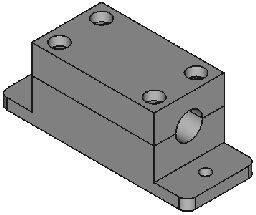

## Organización de las carpetas:
* freecad: ficheros fuente, modificables con FreeCAD.
* step: formato estándar que puede ser leido por la mayoría de las herramientas CAD
* stl: formato listo para imprimir, no es cómodo para modificar
* img: dibujos de los diseños, para verlos antes de descargar
* doc: documentación

## Carcasa de rodamiento lineal estrecha de 8mm LM8 con un único agujero de sujeción a cada lado:
* El FreeCAD y STEP incluyen parte superior e inferior
* [thinlinbearhouse1rail_lm8.fcad](freecad/thinlinbearhouse1rail_lm8.FCStd)
* [thinlinbearhouse1rail_lm8.stp](step/thinlinbearhouse1rail_lm8.step)
* Parte inferior: [thinlinbearhouse1rail_lm8_bot.stl](stl/thinlinbearhouse1rail_lm8_bot.stl)
* Parte superior: [thinlinbearhouse1rail_lm8_top.stl](stl/thinlinbearhouse1rail_lm8_top.stl)
* 

 [rom4b_blue_monster32x32.vhd](freecad/rom4b_blue_monster32x32.vhd)
